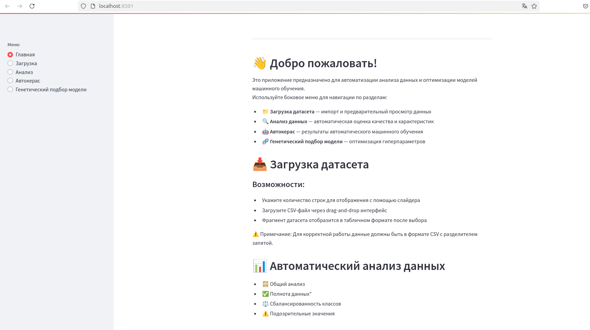
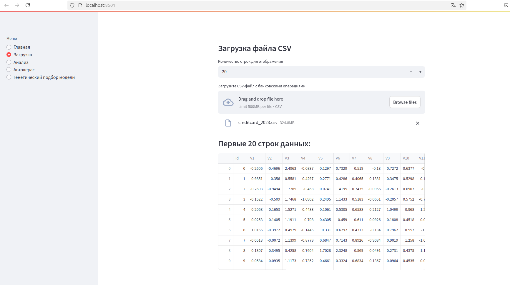
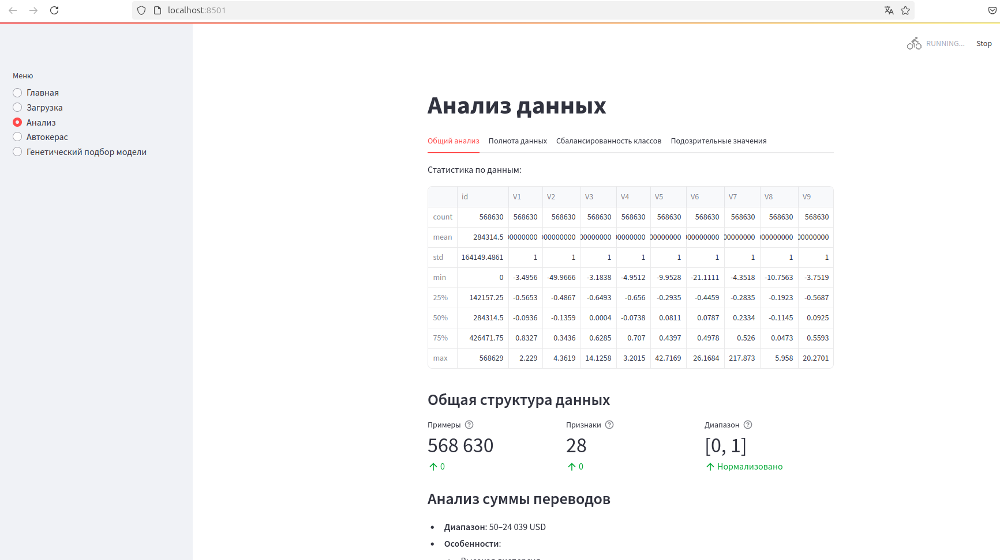
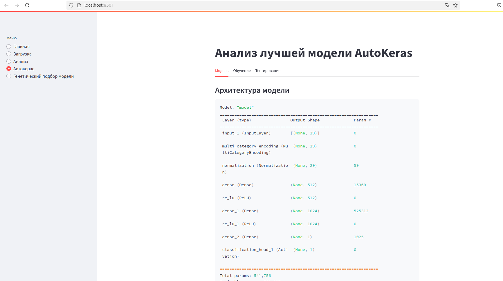
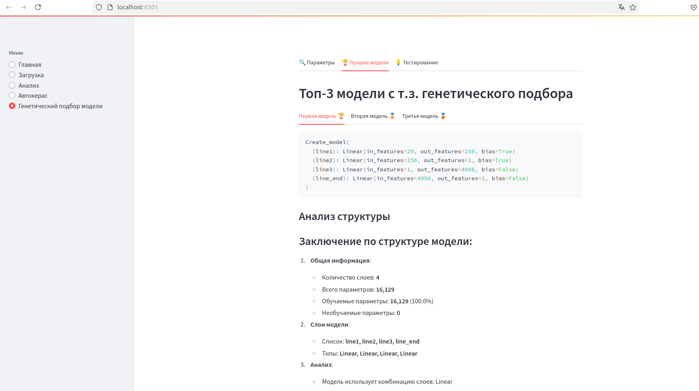

# Credit Card App

[](https://www.python.org/)
[](https://streamlit.io/)

Приложение для обнаружения мошеннических операций с кредитными картами с использованием автоматического машинного обучения.

## Содержание
1. [Требования](#-требования)
2. [Быстрый старт](#-быстрый-старт)
3. [Инструкция по запуску](#-инструкция-по-запуску)
   - [Подготовка окружения](#1-подготовка-окружения)
   - [Загрузка датасета](#2-загрузка-датасета)
   - [Запуск приложения](#3-запуск-приложения)
   - [Альтернативный порт](#4-запуск-на-альтернативном-порту)
4. [Структура проекта](#-структура-проекта)
5. [Интерфейс приложения](#-интерфейс-приложения)
6. [Возможные проблемы](#-возможные-проблемы)
7. [Лицензия](#-лицензия)

## 🛠 Требования
- Python 3.8+
- pip ≥20.0.2
- 1 ГБ свободного места на диске
- Аккаунт на Kaggle (для загрузки датасета)

## 🚀 Быстрый старт
```bash
git https://github.com/dronzhin/Creadit_card
cd credit-card
python3 -m venv venv
source venv/bin/activate  # Linux/MacOS
# venv\Scripts\activate  # Windows
pip install -r requirements.txt
cd Credit_card
mkdir -p dataset
# Скачайте dataset.zip с Kaggle и поместите в папку dataset
streamlit run app.py --server.maxUploadSize 500
```
## 📝 Инструкция по запуску
1. Подготовка окружения
```bash

python3 -m venv venv
source venv/bin/activate  # Linux/MacOS
venv\Scripts\activate  # Windows
pip install -r requirements.txt
```
2. Загрузка датасета

    Скачайте датасет с Kaggle:

    - Вариант 1 (через Kaggle API):

    ```bash
    kaggle datasets download -d nelgiriyewithana/credit-card-fraud-detection-dataset-2023
    unzip credit-card-fraud-detection-dataset-2023.zip -d Credit_card/dataset
    ```
    - Вариант 2 (вручную):

        Перейдите на страницу датасета

        Скачайте dataset.zip и распакуйте в Credit_card/dataset

***Ожидаемая структура файлов:***
```
Credit_card/
├── dataset/
│   ├── credit_card_2023.csv
│   └── credit_card_2023_test.csv
└── app.py
```
3. Запуск приложения

```bash
cd Credit_card
streamlit run app.py --server.maxUploadSize 500
```
Доступные адреса:
```
    Локальный: http://localhost:8501
    Сетевой: http://<ваш_IP>:8501
```
4. Запуск на альтернативном порту

```bash
streamlit run app.py --server.maxUploadSize 500 --server.port 8000
```

## 📂 Структура проекта

```commandline
.Credit_card/
├── dataset/                # Папка с данными
├── mypages/                # Папка с реализацией страниц приложения
│   ├── AutoKeras/          # Папка со вспомогательными файлами для реализации автокерас
│   ├── Genetic/            # Папка со вспомогательными файлами для реализации генетических алгоритмов
│   ├── main.py             # Реализация главной страницы
│   ├── load_csv.py         # Реализация страницы загрузки
│   ├── data_analysis.py    # Реализация страницы анализа датасета
│   ├── my_autokeras.py     # Реализация страницы автокераса
│   └── gen_models.py       # Реализация страниы генетического подбора
├── supporting_files/       # Изображения для документации
├── app.py                  # Основное приложение
├── requirements.txt        # Зависимости
└── README.md               # Документация
```

## 🖥 Интерфейс приложения

👋  *Главная* - Инструкция 



📁 *Загрузка датасета* — импорт и предварительный просмотр данных




🔍 *Анализ данных* — автоматическая оценка качества и характеристик 



🤖 *Автокерас* — результаты автоматического машинного обучения



- 🧬 **Генетический подбор модели** — оптимизация гиперпараметров



     