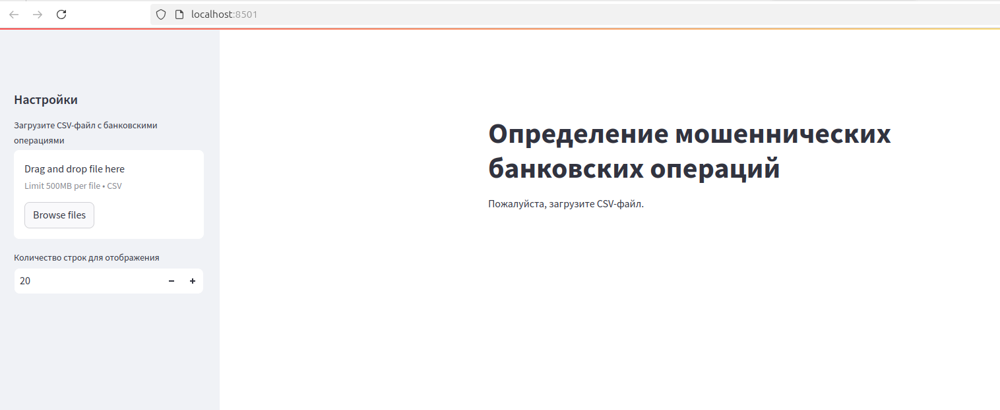
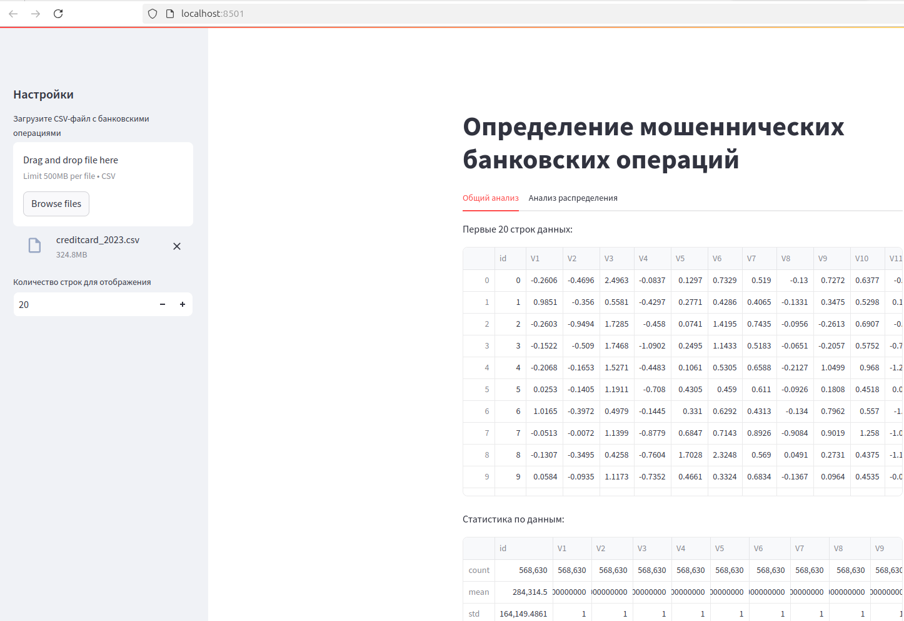

# Инструкция по запуску приложения

## 1. Подготовка окружения
- Создайте виртуальное окружение и активируйте его.
- Установите зависимости из файла `requirements.txt`:
```bash
  pip install -r requirements.txt
```
## 2. Настройка параметров загрузки
- Увеличьте максимальный размер загружаемых файлов до 500 МБ  (по умолчанию — 200 МБ) с помощью команды:
```bash
  export STREAMLIT_SERVER_MAX_UPLOAD_SIZE=500
```
Примечание: Необходимо для работы с набором данных размером ~300 МБ.  

## 3. Загрузка датасета
- Создаем папку dataset
```bach
mkdir dataset
```
- Скачиваем и распаковываем датасет в эту папку:
    https://www.kaggle.com/datasets/nelgiriyewithana/credit-card-fraud-detection-dataset-2023/data
## 4. Запуск приложения 
- Перейдите в директорию Credit_card:
```bash
cd Credit_card
```
- Запустите приложение через Streamlit:
```bash
streamlit run app.py
```
По умолчанию приложение доступно на порту 8501 :

    Локальная ссылка: http://localhost:8501
    Сетевая ссылка: http://<ваш_IP>:8501
## 5. Запуск на альтернативном порту 
- Для смены порта используйте параметр --server.port: 
```bash
streamlit run app.py --server.port 8000
```
## 6. Интерфейс приложения 

После открытия веб-страницы: 

1. Загрузите файл creditcard_2023.csv из директории dataset.
2. Укажите количество отображаемых строк набора данных.
3. После загрузки автоматически будет выполнен анализ данных с визуализацией результатов на двух вкладках.



# Планы по дальнейшему развитию 
## 1. Контейнеризация и масштабирование 

    Создание Docker-контейнера с интеграцией AutoKeras  для развертывания на высокопроизводительных серверах.
    Реализация возможности обучения моделей непосредственно через веб-интерфейс.
     

## 2. Исследование альтернативных решений 

    Тестирование аналогов AutoKeras (например, H2O.ai, TPOT) с последующей интеграцией в приложение через Docker.
     

## 3. Кастомные модели машинного обучения 

    Разработка собственной модели для прогнозирования мошеннических операций.
    Визуализация процесса обучения и метрик модели в реальном времени.
     

## 4. Сравнительный анализ моделей 

    Реализация алгоритма сравнения эффективности различных моделей по ключевым метрикам (точность, полнота, F1-мера).
     